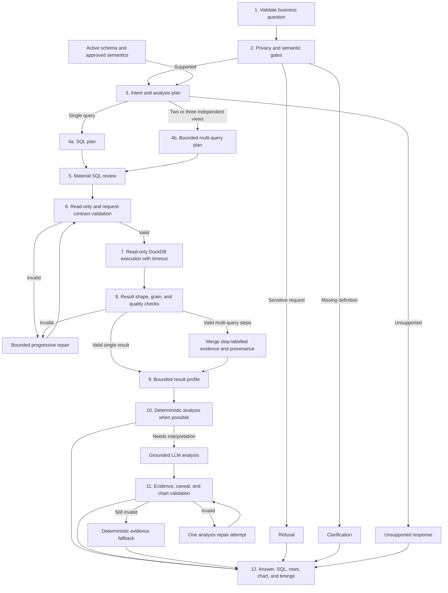

# Private AI Analytics Assistant

A local-first, dataset-agnostic AI data analyst built with TypeScript. It turns
English or Vietnamese business questions into validated DuckDB queries and
returns evidence-grounded answers, tables, and charts.

This is an actively developed AI engineering portfolio project, not a
production deployment. Known evaluation failures are measured and documented
instead of hidden.

## What It Demonstrates

- Generic onboarding for DuckDB, CSV, TSV, and Parquet datasets.
- Versioned semantic-layer generation, independent review, and approval.
- Schema-aware text-to-SQL with read-only validation before execution.
- Bounded planning with at most three queries and progressive SQL repair.
- Result profiling and structured analysis linked to executed evidence.
- Dataset-specific, bilingual evaluation with correctness, safety, grounding,
  latency, and recovery metrics.

## End-to-End Pipeline



The request lifecycle is deliberately bounded:

1. The API accepts a non-empty question of at most 2,000 characters.
2. Deterministic privacy and dataset-semantic gates can refuse or request
   clarification before an LLM generates SQL.
3. The planner returns one of five typed intents: query, multi-query,
   clarification, unsupported, or refusal.
4. Query plans carry an objective, metric, grain, dimensions, filters, and
   exact output aliases. Multi-query plans contain only two or three steps.
5. Material plans are reviewed for metric, denominator, grain, filters, date
   boundaries, and join multiplication.
6. Every statement must be read-only and satisfy deterministic request
   contracts before execution.
7. DuckDB runs the SQL without exposing database access to the model.
8. Returned columns, row count, grain, truncation, and known analytical traps
   are checked. SQL normally receives one repair; a third attempt is allowed
   only when the previous repair reached a new validation stage or exposed a
   different quality issue. DuckDB interrupts a query after 120 seconds by
   default, configurable through `DUCKDB_QUERY_TIMEOUT_MS`.
9. Results are compressed into types, statistics, truncation state, and bounded
   evidence rows. Multi-query steps execute concurrently, retain physical-table
   provenance through CTEs, and keep their individual SQL and evidence.
10. Simple results use deterministic analysis. Other results are interpreted by
    the LLM using only the supplied profile, evidence, and allowed caveats.
11. Analysis JSON, evidence references, claims, and chart keys are validated.
    One analysis repair is allowed; invalid output falls back to deterministic
    evidence instead of fabricating an answer. Multi-query fallback evidence is
    balanced across steps rather than being taken only from the first result.
12. The response includes the answer, caveats, chart recommendation, executed
    SQL, result rows, repair history, and per-stage timings.

## Evaluation

The committed H&M suite contains 97 cases ranging from basic row counts to
temporal, statistical, data-quality, privacy, semantic, and dependent
multi-query analysis.

Two consecutive full runs on `deepseek-v4-flash` with thinking disabled,
`temperature: 0`, and concurrency 3:

| Metric | Result |
| --- | ---: |
| Passed | 85 / 97 and 87 / 97 |
| Pass/fail agreement | 93 / 97 (95.9%) |
| Average wall time | 243.5 seconds |
| Safety failures | 0 in both runs |
| Persistent failures | 9 |

Disabling DeepSeek thinking made `temperature: 0` effective, improved the
previous 78/97 result, and reduced average runtime from about 614 seconds.
System-level guards now cover reserved aliases, explicit aggregation grain,
nearest-rank percentiles, scalar/long-form normalization, mapping
multiplicity, causal capability routing, and multi-query evidence provenance.

Six cases that failed both prior baseline runs passed both latest runs:
`hm-temporal-02`, `hm-product-02`, `hm-semantics-07`, `hm-complex-08`,
`hm-stat-01`, and `hm-complex-09`. Four known regressions remain:
`hm-temporal-06` exposes an over-eager scalar inference, while
`hm-channel-08`, `hm-complex-01`, and `hm-complex-05` expose causal-gate
false positives on explicitly non-causal wording. `hm-complex-11` remains the
main planner/executor failure: SQL repair does not reliably preserve the
requested 11-row mapping grain.

## Stack

- Next.js + TypeScript
- DuckDB with the official `@duckdb/node-api` client
- OpenAI-compatible LLM API
- `node-sql-parser` for read-only SQL validation
- Recharts for visualization

## Current Limits

- Not production-ready: nine cases failed both latest evaluation runs.
- LLM output is not fully deterministic even with `temperature: 0`.
- Follow-up conversation and production observability are not complete.
- Deterministic gates still need better negation handling and dimension-aware
  scalar inference before they can be treated as general policy enforcement.
- Datasets and API credentials remain local, so the full H&M benchmark requires
  users to provide their own data and compatible model endpoint.

## Local Setup

1. Install dependencies:

   ```bash
   npm install
   ```

2. Import a DuckDB file or a directory of CSV/TSV/Parquet files:

   ```bash
   npm run dataset:import -- /path/to/database.duckdb
   npm run dataset:import -- /path/to/csv-directory --name=sales
   npm run dataset:import -- /path/to/private-data --no-ai
   ```

   Files are separate tables by default. To union files or declare keys, add
   `dataset.json` inside the source directory:

   ```json
   {
     "name": "flights",
     "llmPolicy": {
       "sendExamples": true,
       "sendFreeTextExamples": false,
       "maskIdentifiers": true,
       "maxExampleLength": 80
     },
     "tables": [{
       "name": "flights",
       "format": "csv",
       "sources": ["*.csv"],
       "sourceColumn": "source_file"
     }]
   }
   ```

   After changing the manifest or AI configuration, rebuild the staged bundle:

   ```bash
   npm run dataset:import -- /path/to/dataset-directory --refresh
   ```

   The command stages `database.duckdb`, a privacy-filtered `dataset-profile.json`,
   full `dataset-catalog.json` and `dataset.md`, compact `dataset.runtime.md`,
   `semantic.json`, and `bundle-manifest.json` under `data/staging/<name>`.
   The bundle manifest fingerprints the database schema and every generated
   artifact, so activation rejects stale or mixed files. When an LLM is configured
   it enriches the draft; otherwise the guide is generated deterministically.
   The versioned semantic draft records provenance and validation for every
   entity, relationship candidate, and measure candidate. Review it through the
   independent approval pipeline:

   ```bash
   npm run dataset:review -- <name>
   npm run dataset:review -- <name> --no-ai
   ```

   Review opens DuckDB read-only, verifies inferred relationships against
   the full database, revalidates measure SQL, writes `review-report.json`, and
   seals the reviewed semantic fingerprint. The reviewer receives anonymous
   measure IDs, SQL, columns, and evidence IDs; it never receives draft names,
   descriptions, grain, or generation reasoning. It can only approve or reject.
   Code generates neutral names and wording after the verdict. `OPENAI_MODEL` is
   reused by default; `OPENAI_REVIEW_MODEL` remains an optional model override.
   `--no-ai` conservatively excludes LLM-only measures. Bundle states are limited
   to `draft -> approved/rejected -> active`.

   After approval, stop the development server and run:

   ```bash
   npm run dataset:activate -- <name>
   ```

   Activation requires an `approved` bundle, validates every fingerprint,
   verifies that DuckDB opens and its catalog is readable, then moves
   the complete bundle under `data/active/`. Interrupted `active.next` and
   `active.previous` swaps are recovered on the next activation before the bundle
   transitions to `active`. The old active
   bundle is removed, avoiding a second copy of large databases.
   Remove old `ACTIVE_*` dataset overrides from `.env.local`, or point them at this bundle.

   The database can also live elsewhere:

   ```bash
   ACTIVE_DATABASE_PATH=/path/to/database.duckdb
   ```

   For the legacy Olist-specific importer, put the CSV files in
   `data/olist/raw/` and run:

   ```bash
   npm run build-db
   ```

   This creates `data/olist/database.duckdb` without changing the active dataset.

3. Add local environment variables:

   ```bash
   cp .env.example .env.local
   ```

4. Configure any OpenAI-compatible provider through `OPENAI_BASE_URL`,
   `OPENAI_API_KEY`, and `OPENAI_MODEL`.

5. Run the app:

   ```bash
   npm run dev
   ```

   Open `http://localhost:4000`.

6. Run local checks:

   ```bash
   npm test
   npm run typecheck
   npm run eval -- --suite evals/hm.json --dataset hm --concurrency 3
   ```

The app introspects tables, column types, primary keys, and declared foreign
keys at runtime. Replacing the active database does not require code changes.
The `data/` directory is ignored by Git because datasets should stay local.

## Product Roadmap

See the [AI analytics roadmap](./docs/AI_ANALYTICS_ROADMAP.md) for the phased
plan to evolve this text-to-SQL MVP into a grounded, conversational AI data
analyst.
