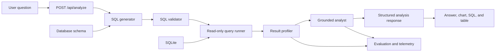

# AI Analytics Assistant Roadmap

This document describes how Private AI Analytics Assistant will evolve from a
text-to-SQL demo into a grounded, private AI data analyst.

## Product outcome

A user should be able to ask a business question in English or Vietnamese and
receive:

- A direct answer supported by query results.
- The generated SQL and result table.
- Key findings, trends, and anomalies.
- A chart selected from the shape of the data.
- Caveats when the data cannot support a strong conclusion.
- Suggested follow-up questions.

The assistant must never present an unsupported number as a fact. Every numeric
claim in the answer must be traceable to an executed query result.

## Current implementation baseline

The repository already provides the execution foundation:

| Capability | Current status |
| --- | --- |
| Schema extraction | Implemented |
| English and Vietnamese text-to-SQL | Implemented |
| Read-only SQL validation | Implemented |
| SQLite execution | Implemented |
| Default result limit | Implemented |
| Result table | Implemented |
| Basic bar and line charts | Implemented |
| Grounded narrative analysis | Implemented |
| One-retry SQL recovery | Implemented |
| Bounded multi-query analysis | Implemented |
| Evaluation dataset and metrics | Implemented: 73 cases |
| Generic dataset import and profiling | Implemented |
| Semantic review and approval state machine | Implemented |
| Follow-up conversation | Missing |
| Query timeout and cancellation | Missing |
| Production observability | Partial: request and eval timings |

## Design principles

1. **Ground answers in executed data.** The model may interpret results but may
   not invent facts outside them.
2. **Use a deterministic pipeline first.** A two-call LLM workflow is easier to
   test than an autonomous agent loop.
3. **Keep SQL execution constrained.** The model never receives direct database
   access; it can only propose SQL that passes the existing validator.
4. **Stay local-first.** Schema, data, prompts, and inference remain on the
   private machine unless the user deliberately configures another provider.
5. **Measure before adding complexity.** Add retrieval, multiple agents, or a
   framework only when evaluation data shows a real need.

## Technology and scaling direction

TypeScript and Next.js remain the primary application stack. The current UI,
API, LLM orchestration, SQL safety, dataset lifecycle, and evaluation pipeline
share one typed implementation; a FastAPI rewrite would duplicate working code
without removing the actual scaling constraints.

Scale in this order:

1. Keep the local-first TypeScript application while usage is single-node.
2. Move long SQLite queries, imports, and reviews to separate TypeScript worker
   processes when concurrent requests begin blocking the web process.
3. Move job and dataset metadata to PostgreSQL and immutable bundles to object
   storage when multiple application instances need shared state.
4. Replace SQLite with an analytical database or warehouse when measured query
   latency, concurrency, or dataset size requires it.
5. Add a Python worker only for Python-native workloads such as forecasting,
   statistical modeling, notebooks, or machine learning. Do not rewrite the
   Next.js application solely to introduce Python.

## Target architecture



The SQL generator and grounded analyst can use the same local model, but they
have separate prompts and output contracts.

## Phase 0: Generic dataset onboarding — completed

### Goal

Turn an operator-provided SQLite database or CSV/TSV directory into one
integrity-checked active analytical dataset with inspectable context.

### Implemented flow

1. `dataset:import` builds SQLite, profiles schema and data, and writes a
   versioned semantic draft with provenance.
2. `dataset:review` validates database integrity, relationships, measures, and
   evidence through a blind reviewer plus deterministic policy gates.
3. `dataset:activate` accepts only a review-sealed approved bundle and swaps it
   into `data/active` with crash recovery.

The active bundle contains its database, compact runtime guide, structured
semantic layer, review report, and fingerprint manifest. Re-importing a dataset
returns it to `draft`; activation replaces the previous active dataset.

## Request lifecycle

For the first analyst version, one request follows this bounded sequence:

1. Validate the question.
2. Generate one read-only SQL statement using the current schema.
3. Parse and validate the SQL.
4. Execute it against SQLite.
5. Build a compact result profile.
6. Ask the model to interpret only that profile and the returned rows.
7. Validate the structured analysis response.
8. Return the answer, evidence, chart specification, SQL, and rows.

If SQLite rejects generated SQL, the system may make one repair attempt using
the error message and schema. It must not retry indefinitely.

## Response contract

`POST /api/analyze` should return one stable structure:

```ts
type AnalysisResponse = {
  question: string;
  sql: string;
  result: {
    columns: string[];
    rows: Array<Record<string, string | number | null>>;
    rowCount: number;
  };
  analysis: {
    summary: string;
    insights: Array<{
      statement: string;
      evidence: string[];
    }>;
    caveats: string[];
  };
  chart: {
    type: "bar" | "line" | "none";
    xKey?: string;
    yKeys?: string[];
  };
  followUpQuestions: string[];
  timings: {
    sqlGenerationMs: number;
    queryMs: number;
    analysisMs: number;
  };
};
```

The `evidence` entries should reference returned columns and values, for example
`"2024-03 revenue = 125430.20"`. This makes hallucinated conclusions easier to
detect in tests and in the UI.

## Phase 1: Grounded single-query analyst

**Status:** Implemented.

### Goal

Turn the current generated SQL result into a useful business answer without
introducing conversation memory or autonomous tool use.

### Backend changes

- Extract the OpenAI-compatible request code from `lib/llmSql.ts` into a small
  shared `lib/llmClient.ts` helper.
- Extract safe database execution from `app/api/query/route.ts` into
  `lib/queryRunner.ts` so both API routes use the same path.
- Add `lib/resultProfile.ts` to calculate column types, numeric ranges, totals,
  averages, null counts, and a bounded row sample.
- Add `lib/llmAnalysis.ts` with a prompt that receives the question, SQL,
  result profile, and bounded rows.
- Add `app/api/analyze/route.ts` as the orchestration endpoint.
- Add runtime validation for the structured model response using simple manual
  checks before considering a new validation dependency.

### Frontend changes

- Add `components/InsightPanel.tsx` for summary, evidence, and caveats.
- Update `ChartPanel` to consume the returned chart specification instead of
  guessing entirely from the first numeric column.
- Keep the SQL editor and manual `Run SQL` path for transparency and debugging.
- Change the main action from `Ask AI` to `Analyze`.

### Context limits

Do not send all query rows back to the model. Send:

- Column names and detected types.
- Aggregate statistics produced by `resultProfile`.
- At most 50 representative rows.
- The total row count and a flag when rows were truncated.

### Acceptance criteria

- A question returns SQL, rows, a chart, and a narrative answer in one request.
- Every insight contains evidence present in the returned result.
- Empty results produce a clear caveat instead of a fabricated explanation.
- Invalid model JSON produces a readable error.
- SQL validation and read-only execution remain unchanged.

## Phase 2: Evaluation and reliability

**Status:** Implemented for the original Olist evaluation domain. The runner
currently covers 73 English and Vietnamese cases, including 12 multi-query and
6 refusal cases. Dataset-independent evaluation is the next milestone.

### Goal

Measure whether the assistant is correct before adding memory or agentic
behavior.

### Evaluation dataset

Add `evals/questions.json` with at least 40 representative questions across:

- Revenue and order trends.
- Product and category performance.
- Reviews and customer experience.
- Delivery performance.
- Payment behavior.
- Vietnamese questions.
- Ambiguous or unsupported questions.
- Unsafe or adversarial prompts.

Each case should contain the question, expected tables, expected result facts,
and whether the assistant should refuse or add a caveat. Exact SQL matching is
not required when different queries produce the same correct result.

### Metrics

Track:

| Metric | What it measures |
| --- | --- |
| SQL execution rate | Generated queries that run successfully |
| Result correctness | Expected facts present in query results |
| Grounded insight rate | Claims supported by returned evidence |
| Unsafe-query rejection | Write or multi-statement SQL blocked |
| Empty-result handling | No fabricated answer when no rows exist |
| End-to-end latency | SQL generation, query, and analysis time |

Store evaluation output as JSON so model, quantization, prompt, and latency can
be compared between runs.

### Reliability changes

- Allow at most one SQL repair attempt.
- Add explicit time and row budgets to every analysis request.
- Record model name, prompt version, generated SQL, errors, and timings.
- Version the SQL and analysis prompts in code.
- Add tests for result profiling and structured analysis parsing.

### Model comparison

Benchmark the current Qwen3.5 9B Q3 model against smaller, faster models.
Choose the default from measured correctness, latency, and memory use rather
than model size alone.

### Acceptance criteria

- The evaluation runner produces a repeatable score report.
- Prompt or model changes can be compared against a saved baseline.
- No release is accepted when safety or groundedness regresses.

## Next milestone: Dataset-independent end-to-end evaluation

### Goal

Prove that an imported and approved dataset improves real analysis quality, not
only that its database and semantic artifacts are structurally valid.

### H&M baseline

Create a committed evaluation pack that covers:

- Row counts and neutral recorded-value aggregates.
- Monthly trends using the documented date strategy.
- Valid joins from transactions to articles and customers.
- English and Vietnamese questions.
- Ambiguous requests such as "revenue" that require a caveat because currency
  and business meaning are not confirmed.
- Unsafe prompts and unsupported causal claims.

Store expected facts from independently executed SQL rather than exact generated
SQL strings. Record execution rate, fact correctness, grounded insight rate,
unsafe-query rejection, latency, model, prompt version, and active dataset
fingerprint.

### Acceptance criteria

- The H&M suite is repeatable against the approved active bundle.
- Every accepted numeric claim maps to an executed result fact.
- Prompt or model changes can be compared with a saved baseline.
- A release cannot regress SQL safety, groundedness, or dataset semantics.

## Phase 3: Conversational follow-ups

**Status:** Planned after dataset-independent evaluation is stable.

### Goal

Support questions such as "Why did that month drop?" without losing the data
context that produced the previous answer.

### Conversation context

Store only the compact state required for a follow-up:

- Previous user question.
- Executed SQL.
- Result profile and evidence.
- Previous summary and caveats.

Do not resend entire result tables or unlimited chat history. Start with the
browser sending the previous compact turn to `/api/analyze`; add persistent
server-side sessions only when users need saved history.

### Follow-up behavior

The model first classifies a message as:

- A new independent analysis.
- A refinement of the previous query.
- A request to explain existing results.

Explanation-only follow-ups should reuse existing evidence and avoid another
database query. Refinements may generate one new query.

### Acceptance criteria

- Pronouns and references such as "that category" resolve correctly.
- A follow-up never silently changes the metric or time range.
- Conversation context remains bounded.
- Users can clear the analysis session.

## Phase 4: Bounded multi-step analysis

**Status:** Implemented with at most three planned query steps and bounded
evidence rows. Continue measuring it through the dedicated eval subset.

### Goal

Answer questions that genuinely require more than one query, such as comparing
delivery delays with review scores across regions.

### Agent loop

Only add this phase after single-query evaluation is stable. The planner may:

1. Propose a short analysis plan.
2. Call the existing safe query runner.
3. Inspect result profiles.
4. Run at most three queries.
5. Produce a final evidence-linked answer.

Enforce hard limits on query count, rows, tokens, and wall-clock time. The only
initial tool is `run_read_only_query`; the model receives no filesystem, shell,
or arbitrary code execution capability.

### Acceptance criteria

- Multi-step cases outperform the single-query baseline on a dedicated eval
  subset.
- The assistant shows the plan and every executed SQL statement.
- The loop always stops within configured budgets.
- Partial results are reported honestly when a step fails.

## Phase 5: Portfolio and production hardening

**Status:** Partial. Local-first portfolio behavior exists; production controls
remain future work.

### Portfolio deliverables

- Architecture diagram and 60-second demo video.
- Evaluation table comparing models or prompts.
- Screenshots of English, Vietnamese, empty-result, and blocked-query cases.
- A documented failure case and the change that fixed it.
- Measured latency and memory use on the target machine.

### Production boundaries

Before any public deployment, add:

- Authentication and per-user authorization.
- Request rate limits and query timeouts.
- Audit logs with prompt and result redaction.
- Dataset-level access controls.
- Retention rules for questions and analysis history.
- Health checks and operational metrics.

The portfolio demo may remain local-first. Public multi-tenant infrastructure
is not required to demonstrate AI engineering quality.

## Risks and mitigations

| Risk | Mitigation |
| --- | --- |
| Valid SQL answers the wrong question | Result-fact evals, not string matching |
| Narrative invents a conclusion | Evidence required for every insight |
| Local model is slow | Bounded context, result profiling, measured model choice |
| Large results exceed context | Aggregates plus a maximum 50-row sample |
| Follow-up context drifts | Preserve executed SQL and evidence, not only prose |
| Expensive or abusive queries | Read-only runner, limits, timeout, query budget |
| Agent loop never stops | Maximum three queries and a wall-clock budget |

## Explicit non-goals for the first release

- No LangChain or agent framework.
- No vector database for the nine-table Olist schema.
- No multiple cooperating agents.
- No public, untrusted, multi-tenant dataset uploads. Local operator-controlled
  dataset import is supported.
- No autonomous shell or Python execution.
- No public multi-tenant deployment.

These can be reconsidered only when a measured requirement justifies them.

## Recommended delivery order from the current baseline

1. Add the H&M dataset-independent evaluation pack and save a baseline result.
2. Add query timeout, cancellation, and concurrency limits before public usage.
3. Add bounded conversational follow-ups using executed SQL and evidence.
4. Add structured operational logs, redaction, and health metrics.
5. Move long-running work to TypeScript workers when measurements show web
   process contention.
6. Add shared metadata/storage and a larger analytical database only when a
   multi-instance or data-volume requirement appears.
7. Add an optional Python worker only for a proven Python-native analysis need.

## Definition of done

The project can be presented as an AI analytics assistant when it:

- Answers business questions with evidence-linked narrative insights.
- Preserves the existing SQL safety boundary.
- Handles empty, ambiguous, and unsupported questions honestly.
- Passes a documented evaluation suite.
- Reports latency and model configuration.
- Imports, reviews, and activates a new dataset without code changes.
- Passes a dataset-specific evaluation baseline for the active bundle.
- Demonstrates at least one English and one Vietnamese end-to-end analysis.
